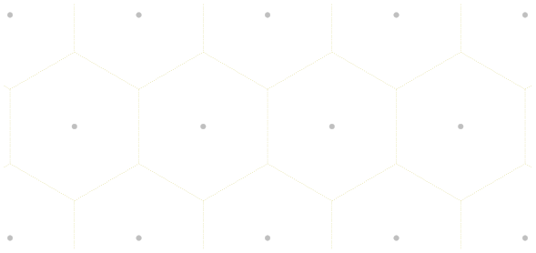
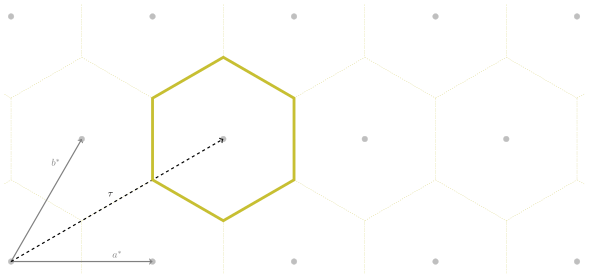
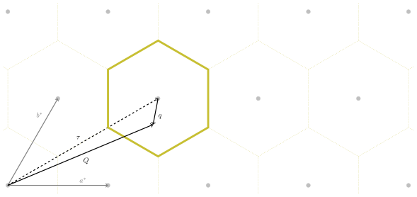
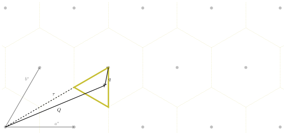

# Lattices, Brillouin zones and why brille interpolates

The main goal of `brille` is to support *you* in leveraging the symmetry of your crystal system to speed-up simulation and analysis of large, partly redundant, reciprocal space datasets. The first step to achieve this goal is finding the volume of reciprocal space which contains all possible information for your system from the lattice basis vectors and symmetry operations which you provide. With the minimum volume identified, a space-filling grid is then constructed following the parameters you specify. If you then provide calculated values for the vertices of the grid, the 'filled' grid can be used to interpolate your calculations to all points within the volume. Importantly, if your calculated values are modified by the application of a pointgroup symmetry operation, the interpolation routine can automatically correct the interpolated results for this effect in some cases.

## Lattices

An infinite set of points which are indistinguishable for a specific set of rigid translations form a lattice.

The easiest conceived lattice is one formed by the combinations of the whole numbers on a set of Cartesian axes. In two dimensions, this is equivalent to the intersections of lines on a piece of graphing paper. If the vector pointing from any one such intersection point to its neighbour along the $x$ axis is $\mathbf{a}=[1\,0]$, and along the $y$ axis is $\mathbf{b}=[0\,1]$, then the allowed translations which result in an indistinguishable lattice are $\mathbf{r} = i\mathbf{a} + j\mathbf{b}$ where both $i$ and $j$ are integers.

Although only translational invariance is necessary for a lattice, this specific lattice has a number of additional invariant operations in the form of rotations and rotoinversions that form a group,

$$
\mathbb{G} = \begin{pmatrix} 1 & 0\\0 & 1\end{pmatrix}, \begin{pmatrix} 0 & -1\\1 & 0\end{pmatrix}, \begin{pmatrix} 0 & 1\\1 & 0\end{pmatrix}, \ldots
$$

where for every element, $G\in\mathbb{G}$, there exists an equivalent product of elements of $\mathbb{G}$. This allows a reduced representation of $\mathbb{G}$ by a minimal set of its elements, called its generators, which can be combined to produce all other elements.

Lattices like the one described above, where the repeated unit is point-like, are called *Bravais* lattices and, in three dimensions, there are $14$ unique Bravais lattices.

If the repeated unit is considered independent of the lattice, it is possible to conceive of shapes which have their own rotation and rotoinversion symmetries. There are $32$ unique sets of rotational symmetries in three dimensions each of which forms a *Point group*.

Combining the symmetries of a Point group and a Bravais lattice gives rise to a set of symmetry operations which is comprised of rotations, rotoinversions, translations, screw axes, and glide planes which form a *Space group*, of which there are $230$ distinct combinations in three dimensions.

All crystalline materials have a structure characterised by one of the Space groups.

### Dual lattices

While the specific example of a [`Lattice`][brille._brille.Lattice] given above was described in terms of a physical lattice, Lattices are not limited to any one space. For every Lattice there exists a dual lattice which is, effectively, its inverse. While a direct lattice describes atom positions, its dual lattice describes the relative orientations of *planes* of atoms. Constructing such a dual lattice is straightforward following references easily found elsewhere, but importantly where a lattice can be described by the lengths of its basis vectors, the basis vectors of its dual lattice have units of inverse, or reciprocal, length. The [`Lattice`][brille._brille.Lattice] class combines both the real space direct lattice and its reciprocal space dual lattice into a single object.

### Physical properties

The physical properties of any crystalline material have the same symmetry as its Space group. The goal of `brille` is to simplify leveraging the Space group symmetry information in other software projects dealing with the physical properties of crystalline materials.

## Brillouin zone

The region of space around each lattice point which is closer to that point than to any other is its Wigner-Seitz cell. As we can see for the case of a Lattice with hexagonal symmetry, the Wigner-Seitz cells of all lattice points tile the space of the Lattice.

If we consider that the Lattice is a Reciprocal lattice, with basis vectors $\mathbf{a}^*$ and $\mathbf{b}^*$, then we can construct the Wigner-Seitz cell for any lattice point $\boldsymbol{\tau} = h\mathbf{a}^* + k\mathbf{b}^*$ by finding the intersections of all planes, each described by the point $\boldsymbol{\tau}+\frac{i}{2}\mathbf{a}^*+\frac{j}{2}\mathbf{b}^*$ and normal vector $i\mathbf{a}^*+j\mathbf{b}^*$ with $i,j$ integers; the Wigner-Seitz cell is bounded by all such planes *without* any planes closer to $\boldsymbol{\tau}$.

This is also the definition of the first Brillouin zone, where higher-order Brillouin zones are the regions between planes successively further from $\mathbf{G}$.

Since the properties of the lattice follow the periodicity of the lattice, any measurable quantity must repeat from one first Brillouin zone to the next. This allows for descriptions of the physical properties which depend on, e.g., a reduced momentum transfer $\mathbf{q} = \mathbf{Q}-\mathbf{G}$

### The irreducible Brillouin zone

The first Brillouin zone as described above ignores the possibility of rotational symmetries. Such a definition of the Brillouin zone contains redundant information in the case of a system possessing a non-trivial Point group, and a smaller cell is the true Brillouin zone. To distinguish the translation-only *first* Brillouin zone from the true Brillouin zone, we introduce the term *irreducible*. Note that in the case of a trivial Point group symmetry the *first* and *irreducible* Brillouin zones are identical.

If the two-dimensional hexagonal lattice above possesses a six-fold rotation axis perpendicular to the plane, so that the information within each first Brillouin zone is repeated six times, then the zone can be *reduced*. Like the translation-only first Brillouin zone, the definition of an irreducible zone is not unique, but one choice for this reciprocal lattice is shown below

The properties at an arbitrary momentum transfer $\mathbf{Q}$ can be related to those within the irreducible first Brillouin zone by

$$
\mathbf{Q} = G \mathbf{q}_\text{ir} + \boldsymbol{\tau}
$$

where $G$ is one of the Point group operators, $\mathbf{q}_\text{ir}$ is a vector within the irreducible first Brillouin zone, and $\boldsymbol{\tau}$ is a Reciprocal lattice point.

Since the irreducible first Brillouin zone contains all of the information about the physical properties of a material, it can and should be used by projects aiming to model those properties efficiently. To help in this task, `brille` defines [`BrillouinZone`][brille._brille.BrillouinZone] to construct the first Brillouin zone and an irreducible Brillouin zone for any Reciprocal lattice.

### Inelastic neutron scattering

Inelastic neutron scattering is an experimental technique which measures the probability of transitions between states of a condensed matter system, which in turn can tell us about the types and strengths of interactions within the material.

Inelastic neutron scattering benefits from the use of neutrons with wavelengths comparable to typical interatomic spacings *and* energies comparable to typical energy levels of condensed matter systems.

The straightforward comparison of intensity measured on a neutron spectrometer and favourable wavelength and energy of available neutrons compensates for the difficulty of neutron production compared to, e.g., x-rays which are easier to produce but can not have both favourable wavelengths and energies in the same photon.

The difficulty of producing neutron beams led to the development of instruments like the Direct Geometry Time of Flight neutron spectrometer. Such instruments have an array of detectors at fixed positions and detect changes in the neutron energy by measuring the time it takes for a detected neutron to arrive at the detector. By knowing the neutron's initial, $\mathbf{k}_\text{i}$, and final momentum, $\mathbf{k}_\text{f}$ it is straightforward to work out the momentum and energy transferred to the sample.

$$
\begin{aligned}
\mathbf{Q} & = \mathbf{k}_\text{i} - \mathbf{k}_\text{f} \\
E & = \frac{\hbar^2}{2m_\text{n}}\left(k_\text{i}^2 - k_\text{f}^2\right)
\end{aligned}
$$

## Why interpolate

Through the use of one or more choppers, Direct Geometry Time of Flight spectrometers select a single $\mathbf{k}_\text{i}$ for all neutrons which interact with the sample before being counted in a detector. Each detector is at a unique set of spherical angles $(\theta,\phi)$ relative to $\hat{\mathbf{k}_\text{i}}$ and therefore each counts neutrons with a unique $\hat{\mathbf{k}}_\text{f}$. As a result each detector measures along a path through reciprocal $(\mathbf{Q},E)$ space which is constrained by the kinematic relations listed above.

Theoretical models of interactions in a material typically involve solving an eigenvalue problem for a given $\mathbf{Q}$ and are therefore best suited for simulating along $(\mathbf{Q},E)$ paths with constant-$\mathbf{Q}$. `brille` aims to help such models by reducing the number of $\mathbf{Q}$ points where they must perform their (typically expensive) calculation and interpolates their results onto the $(\mathbf{Q},E)$ paths measured during experiments. To accomplish this, a number of polyhedron-filling connected grids are defined; notably [`BZMeshQdc`][brille._brille.BZMeshQdc] and its variants (see [Grids](grids.md)). The model calculation is evaluated for $\mathbf{Q}$ points defined by the vertices of the cells which comprise the grid. Interpolation is then done by finding the cell which encloses the desired point and weighting the pre-calculated values at its vertices linearly, by the position of the point within the cell.
