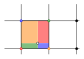
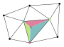
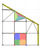

# Interpolation grids

A grid divides the irreducible Brillouin zone into cells whose corners, the
grid's vertices, are where your model is evaluated. To interpolate at any other
point, brille finds the cell that holds it and weights the values at that cell's
corners by where the point lies within it. This page explains the ways such a
grid can be built, and the three that brille provides.

## Cells: parallelepipeds and simplices

There are many ways to divide a space, but the two simplest building blocks
are the parallelepiped (a rectangle in two dimensions) and the simplex (a
triangle in two dimensions, a tetrahedron in three). A simplex in $N$
dimensions has $N+1$ corners, a parallelepiped $2^N$.

Parallelepipeds make a regular grid:

while simplices can be regular or, as here, irregular:

Within a parallelepiped, a point's value is the average of the corner values
weighted by the areas of the opposite sub-rectangles (bilinear interpolation,
trilinear in three dimensions):

Within a simplex, the weights are the point's barycentric coordinates, the
areas (volumes) of the sub-simplices opposite each corner, and the
interpolation is linear:

## Why not a regular grid

A regular grid has one great advantage: the cell holding any point can be
calculated directly, so finding it takes constant time. But it fits a
Brillouin zone only when the zone is itself a rectangular box, which is the
case only for the irreducible zones of primitive cubic, tetragonal and
orthorhombic lattices. Anywhere else the grid either misses part of the zone or
reaches outside it, and the interpolation shows artefacts near the zone
boundary. brille therefore has no plain regular grid.

A simplex mesh can fill any polyhedron exactly, but finding which simplex
holds a point is not a simple calculation, so an unstructured mesh needs extra
information to make that fast. brille's three grids differ in how they get
the best of both.

## The structured mesh: `BZMeshQ`

[`BZMeshQdc`][brille._brille.BZMeshQdc] and its siblings are a regular grid
made to fit. The grid is the reciprocal lattice divided $n$ times along each
of its primitive vectors, with $n$ chosen from `max_size`, the largest
tetrahedron volume you ask for. Each grid cell is split into tetrahedra (six,
for most lattices), and the grid is then clipped exactly to the irreducible
zone. Clipping cuts the cells that the zone boundary crosses into smaller
pieces, which are also split into tetrahedra. The geometry is done in exact
arithmetic, so the result fills the zone exactly, whatever the lattice.

Because the mesh is built from the lattice, it has the lattice's symmetry: the
triangles on a zone face match those on the face that symmetry pairs it with.
So interpolation is continuous across the zone boundary, including when a
point is moved into the irreducible zone from elsewhere.

Finding the tetrahedron that holds a point uses a grid of buckets over the
zone, each listing the few tetrahedra that overlap it, so it takes constant
time, as for a regular grid.

The mesh can also be refined where your model needs more points, by splitting
the longest edges of chosen tetrahedra. Equivalent edges on the zone boundary
are split together, so the mesh keeps matching itself, and a resolution limit
stops refinement from making detail finer than an instrument can resolve.
[Building and refining a mesh](../tutorials/mesh.md) shows how.

## The hybrid trellis: `BZTrellisQ`

[`BZTrellisQdc`][brille._brille.BZTrellisQdc] and its siblings combine a
regular grid of cubic nodes with triangulation. Nodes inside the zone stay
whole, and their values are interpolated trilinearly. Nodes the zone boundary
crosses are cut to the zone and divided into tetrahedra, with the TetGen
library, and interpolated linearly. Finding the node that holds a point is
direct, and within a cut node only its own tetrahedra need searching.

The trellis's `node_volume_fraction` is the volume of one cubic node in Å⁻³,
despite its name. Its boundary tetrahedra do not match across equivalent zone
faces, so interpolated values can jump there. Mixing trilinear and linear
interpolation also means the interpolant is smooth in different ways inside and
near the boundary.

## The nested mesh: `BZNestQ`

[`BZNestQdc`][brille._brille.BZNestQdc] and its siblings hold several TetGen
triangulations of the zone, each finer than the last, with the overlaps between
successive layers recorded. A point is located in the coarsest layer, then in
the tetrahedra of the next layer that overlap the one found, and so on down to
the finest layer.

If the $i^\text{th}$ layer's tetrahedra each overlap $\left<m\right>_i$ of the
next layer's on average, locating a point takes about

$$
N_\text{checks} \propto \sum_{i=1}^n \left< m \right>_i
$$

in-tetrahedron tests, while the finest layer holds

$$
N_\text{tetrahedra}^n = \prod_{i=1}^n \left< m \right>_i
$$

tetrahedra. In practice the search is far slower than the other two grids' and
the nested mesh is kept only for compatibility.

## Real and complex data

The grids hold eigenvalue-like *values* and eigenvector-like *vectors* at each
vertex, and either may be complex. So each grid comes in three types: the
suffix `dd` holds real values and vectors, `dc` real values and complex
vectors (the usual case for phonons), and `cc` complex values and vectors.

## Choosing a grid

Use the structured mesh unless you have a reason not to.
[Switch from BZTrellisQ to BZMeshQ](../how-to/trellis-to-mesh.md) compares it
with the trellis, and shows how to measure the two for your own system.
