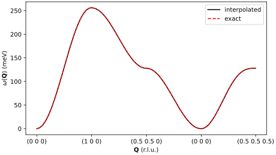
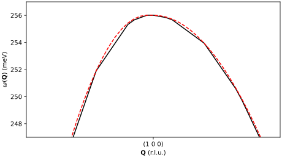

# Interpolating with brille

In this tutorial you will interpolate two things with brille: a linear field,
which linear interpolation reproduces exactly, and the spin-wave dispersion of
iron, which it approximates. Along the way you will meet the three objects
every brille interpolation needs: a lattice, its Brillouin zone, and a grid.

The code is one script, [`interpolation.py`](interpolation.py), which the tests
run. You need brille and NumPy, and matplotlib for the plots.

## A linear field

### The lattice

A grid spans part of reciprocal space, so start with a lattice. This one is
given directly in reciprocal space: three orthogonal basis vectors, each
1 Å⁻¹ long.

```python
--8<-- "tutorials/interpolation.py:lattice"
```

### The Brillouin zone

A grid's extent is always a first or irreducible Brillouin zone, which
[`BrillouinZone`][brille._brille.BrillouinZone] finds from the lattice:

```python
--8<-- "tutorials/interpolation.py:zone"
```

```text
first zone 1.000 Å⁻³, irreducible zone 1.000 Å⁻³
```

The lattice was given no symmetry, so it has only the identity operation, and
its irreducible zone is the whole first zone: the cube from −½ to ½ along each
axis.

### The grid

[`BZMeshQdd`][brille._brille.BZMeshQdd] is a mesh of tetrahedra that fills the
irreducible zone and holds real (`d`, for double) data. `max_size` bounds the
volume of its tetrahedra, in Å⁻³, which sets how many points it has:

```python
--8<-- "tutorials/interpolation.py:grid"
```

Its points are `grid.rlu`, in reciprocal lattice units, and `grid.invA`, in
Å⁻¹; for this lattice the two are the same.

### Fill the grid

A grid holds *values* (scalars, such as energies) and *vectors* (such as
eigenvectors) at each point, and [`fill`][brille._brille.BZMeshQdc.fill]
takes both, with a description of each. Here each point holds one scalar,
$\phi(\mathbf{Q}) = \mathbf{Q}\cdot\hat{\mathbf{x}}$, given as both values and
vectors:

```python
--8<-- "tutorials/interpolation.py:fill"
```

### Interpolate

[`ir_interpolate_at`][brille._brille.BZMeshQdc.ir_interpolate_at] returns the
interpolated values and vectors at any points. Inside the zone, linear
interpolation of a linear field is exact:

```python
--8<-- "tutorials/interpolation.py:inside"
```

A point outside the zone is first moved into it by a reciprocal lattice
vector $\mathbf{G}$, so the result there is $\phi(\mathbf{Q}-\mathbf{G})$, not
$\phi(\mathbf{Q})$: brille assumes the data are periodic in the reciprocal
lattice, as physical properties of a crystal are.

```python
--8<-- "tutorials/interpolation.py:outside"
```

```text
inside the zone, exact: True
outside the zone, phi(Q - G): True
```

## Iron's spin waves

A dispersing excitation has an energy that depends on $\mathbf{Q}$. Iron's
acoustic ferromagnetic spin wave has

$$
\omega(\mathbf{Q}) = \delta + 8 J \left(1 - \prod_i\cos \pi Q_i\right)
$$

with $Q_i$ in reciprocal lattice units, a single-ion anisotropy $\delta$ and
an exchange energy $J$. It has the periodicity and symmetry of iron's lattice,
so brille can interpolate it.

### The lattice and grid

Iron is body-centred cubic, $a = 2.87$ Å, with space group $Im\bar{3}m$. Its
48 point symmetry operations make the irreducible zone a forty-eighth of the
first zone, and the grid needs to cover only that:

```python
--8<-- "tutorials/interpolation.py:iron"
```

```text
iron: irreducible zone 0.0208 of the first, 1741 grid points
```

### Fill and check

```python
--8<-- "tutorials/interpolation.py:dispersion"
```

At its own points, the grid returns exactly what it was given:

```python
--8<-- "tutorials/interpolation.py:check"
```

### Interpolate along a path

Between its points, the grid interpolates linearly, so it differs from the
curved dispersion. Along a path through the zone, from Γ to H $(1\,0\,0)$, N
$(\tfrac12\,\tfrac12\,0)$, back to Γ and on to P $(\tfrac12\,\tfrac12\,\tfrac12)$:

```python
--8<-- "tutorials/interpolation.py:path"
```

```text
along the path: largest error 0.45 meV of 256 meV
```

Most of the path lies outside the irreducible zone. `ir_interpolate_at`
maps each point into it with a symmetry operation and a lattice vector.

```python
--8<-- "tutorials/interpolation.py:plot"
```



Close to the maximum at H, the straight segments of the interpolation are
visible:



A finer grid, a smaller `max_size`, reduces the error.
[Building and refining a mesh](mesh.md) shows how to add points only where
they are needed.
