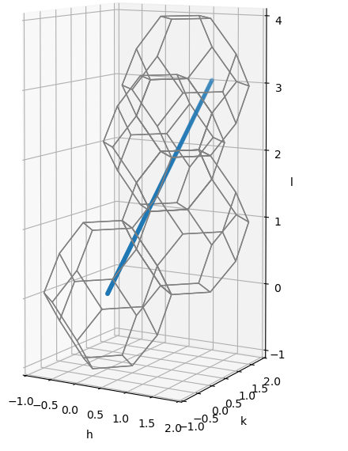
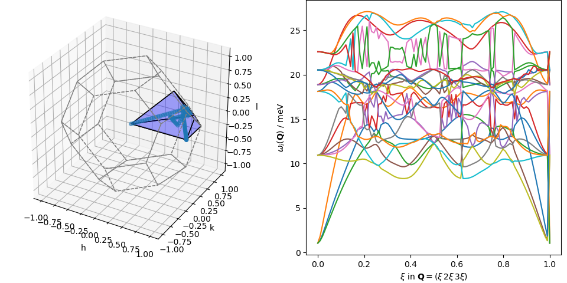

=====================================
Interpolating Sodium Chloride phonons
=====================================

Sodium Chloride forms face-centred cubic crystals in Space group
:math:`F m \bar{3} m` (Hall symbol :math:`-F 4 2 3`) with lattice
parameter :math:`a \approx 5.69` Å.

:doc:`Euphonic <euphonic:index>` is a project which can take force constant information at
gridded positions in :math:`\mathbf{Q}` and use Fourier interpolation to
approximate the dynamical matrix at arbitrary :math:`\mathbf{Q}`.
It can then solve the eigenvalue problem to determine the eigenvalues,
:math:`\omega_i^2(\mathbf{Q})`, and eigenvectors,
:math:`\hat{\epsilon}_{ij}(\mathbf{Q})`, which are the squared energy
and vectors related to the atom-resolved displacements for the
:math:`{i=1,…,3 N_\text{atom}}` phonon branches,
where :math:`{j=1,\ldots,N_\text{atom}}`.

In the specific case of NaCl with its basis described in the face-centred
lattice, the dynamical matrix is a :math:`24\times24` matrix and the eigenvalue
problem can be solved relatively quickly on a modern computer.
Still, it may be advantageous to minimise the work performed by
:doc:`Euphonic <euphonic:index>` and let :py:mod:`brille` do the heavy lifting.

The interface between :py:mod:`brille` and :doc:`Euphonic <euphonic:index>` is implemented as
a class :py:class:`brilleu.BrillEu` in the :doc:`brilleu <brilleu:index>` module.

The first step in creating an appropriate interpolation grid object is to load
the force constant data from, e.g., a CASTEP binary file.
An appropriate file for `NaCl`_ can be used in conjunction with
:download:`this script <tutorial_00.py>` to reproduce the content of this
tutorial.

.. _NaCl: https://github.com/brille/brilleu/raw/master/brilleu/NaCl.castep_bin

.. literalinclude:: tutorial_00.py
    :lines: 28

Constructing the :py:class:`~brilleu.BrillEu` object creates a hybrid grid
in the irreducible Brillouin zone and then uses the
:py:class:`~euphonic.force_constants.ForceConstants` object to store
:math:`\omega_i(\mathbf{q}_\text{ir})` and
:math:`\hat{\epsilon}_{ij}(\mathbf{q}_\text{ir})` at each grid vertex.
The stored data are then used to determine a sorting permutation for each vertex
which attempts to place equivalent modes at equal indexes on all neighbouring
vertices. As we will see, this process is not yet perfected.

Dispersion plots
----------------
Interpolation can be used to determine the dispersion relation along any path
in reciprocal space. One such path starts at the origin and goes to
:math:`\mathbf{Q} = (1\,2\,3)` which is on the Brillouin zone boundary for
:math:`\mathbf{G} = (1\,1\,3)` and passes through the
:math:`\mathbf{G} = (1\,1\,1)` and :math:`\mathbf{G} = (0\,2\,2)`
first Brillouin zones.

    The :math:`(0\,0\,0)`, :math:`(1\,1\,1)`, :math:`(0\,2\,2)`, and
    :math:`(1\,1\,3)` first Brillouin zones and the path from :math:`(0\,0\,0)`
    to :math:`(1\,2\,3)`

We can construct points along the path and find :math:`\omega_i(\mathbf{Q})`
using

.. literalinclude:: tutorial_00.py
    :lines: 31,32,34

Since this path passes through four first Brillouin zones, an equivalent path
must pass through the irreducible Brillouin zone multiple times. We can find
the irreducible path using

.. literalinclude:: tutorial_00.py
    :lines: 50

    The irreducible path is shown in the irreducible Brillouin zone on the left,
    note that it passes through the irreducible polyhedron multiple times.
    The dispersion relation on the right is obtained by linear interpolation
    within the irreducible polyhedron.

Inelastic Neutron Scattering
----------------------------

Inelastic neutron scattering experiments performed with surveying instruments
produce observations of scattering intensity at points in :math:`(\mathbf{Q},E)`
which are not on a regular grid.

The intensity measured in a neutron scattering experiment from one-phonon
scattering

.. math::

    \begin{aligned}
    S(\mathbf{Q}, E) & \propto \sum_i S_i(\mathbf{Q}) \delta(E-\hbar\omega_i(\mathbf{Q})) \\
    S_i(\mathbf{Q}) & = \frac{1}{\omega_i(\mathbf{Q})}
                       \left|\sum_j \frac{b_j}{\sqrt{M_j}}
                                    \mathbf{Q}\cdot\hat{\epsilon}_{ij}(\mathbf{Q})
                                    e^{i \mathbf{Q}\cdot\mathbf{r}^0_j}
                       \right|^2
    \end{aligned}

with :math:`S_i(\mathbf{Q})` and :math:`\omega_i(\mathbf{Q})` directly calculable
from theory via, e.g., :py:class:`~euphonic.structure_factor.StructureFactor`.

If the observations were on a regular :math:`(\mathbf{Q},E)` grid then it would
be straightforward to calculate :math:`S_i(\mathbf{Q})` and
:math:`\omega_i(\mathbf{Q})` for each unique :math:`\mathbf{Q}`
with the extension to :math:`S(\mathbf{Q},E)` involving an approximation to
the convolution of the instrumental resolution and a delta function.

Since, the detectors observe along (nonlinear) kinematically constrained
paths through :math:`(\mathbf{Q},E)`, each observation is likely to have a
unique :math:`\mathbf{Q}` and, as a result, the calculation of
:math:`S_i(\mathbf{Q})` and :math:`\omega_i(\mathbf{Q})` is necessary for
*every* observation.

If the :math:`(\mathbf{Q},E)` observation positions are known for all detectors
then :py:mod:`brille` can be used to find :math:`S(\mathbf{Q},E)`.
Correct handling of the non-uniform observations is non-trivial and special
software packages exist for this purpose, e.g., Horace_.
Here we will avoid these complications by calculating :math:`S(\mathbf{Q},E)`
for all points in a :math:`(\mathbf{Q},E)` grid.

.. literalinclude:: tutorial_00.py
    :lines: 66-71

.. figure:: images/nacl_123_sqw.png
    :align: center
    :alt: NaCl [123] inelastic neutron scattering intensity map

    Inleastic neutron scattering intensity for the same path through recprocal
    space as above.

.. _Horace: https://github.com/pace-neutrons/horace
