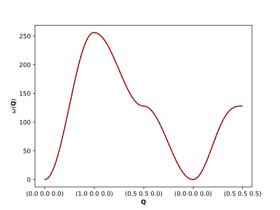
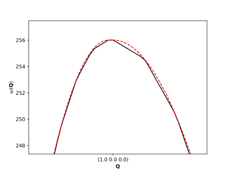

====================
Simple Interpolation
====================

One of the main purposes of `brille` is to perform linear interpolation.
This short tutorial will teach you how to perform simple linear interpolation using `brille`.
All examples here are used in the continuous testing of `brille` and are
from the file `wrap/tests/test_4_interpolation.py` available in the repository.

Interpolation of a scalar field
-------------------------------

A scalar field is any function :math:`\phi(\mathbf{Q})` which is single-valued
at all :math:`\mathbf{Q}`. Here we will interpolate a scalar field of the form
:math:`\phi(\mathbf{Q}) = \mathbf{Q}\cdot\hat{\mathbf{x}}`, which is a linear
scalar field.

Construct the lattice
^^^^^^^^^^^^^^^^^^^^^

Linear interpolation can only be performed using `brille` if a grid is constructed first.
The construction of a grid requires that we define a space-filling lattice,
so we start with that:

.. code-block:: python

  from brille import Lattice
  lattice = Lattice((1, 1, 1), (90, 90, 90), real_space=False)

The created `lattice` spans reciprocal space with three orthogonal basis vectors
each of unit length, :math:`1 \AA^{-1}`, and as a result has a unit cell with
volume :math:`1 \AA^{-3}` which we can access through `lattice.volume`.

Construct the Brillouin zone polyhedron
^^^^^^^^^^^^^^^^^^^^^^^^^^^^^^^^^^^^^^^

To construct the grid we must define its extent, which in `brille` is always a
first or irreducible Brillouin zone polyhedron. Finding this polyhedron may not
be trivial, so it is an independent step (with options to control the algorithm
behaviour, see :py:class:`~brille._brille.BrillouinZone` for details).

.. code-block:: python

  from brille import BrillouinZone
  brillouin_zone = BrillouinZone(lattice)

We did not specify any symmetry information for this lattice, so the default
:math:`P 1` is used, which has an identical first and irreducible Brillouin zone.
Therefore `brillouin_zone` contains an 'irreducible' polyhedron which identical to the
first Brillouin zone polyhedron, accessible through `brillouin_zone.ir_polyhedron`
and `brillouin_zone.polyhedron`, respectively.

Construct the interpolation grid
^^^^^^^^^^^^^^^^^^^^^^^^^^^^^^^^

Finally, we can construct the interpolation grid. We have multiple options
within `brille`, but nearly always we should use one of the :ref:`Hybrid grids <hybrid-grids>`.
In this short tutorial we will interpolate purely real-valued data, so we pick
a :py:class:`~brille._brille.BZTrellisQdd` which holds real-valued eigenvalues
and eigenvectors for every vertex in its grid.
To create a grid we must specify an upper-limit to the grid-cell size, which
also specifies a lower-limit to the number of points in the grid.
Each grid cell contributes one or more vertex to the grid, with the exact
number dependent on details of the grid and bounding polyhedron.
Here we will aim for at least :math:`100` grid points, or a maximum cell
volume of :math:`1\times10^{-2} \AA^{-3}`.

.. code-block:: python

  from brille import BZTrellisQdd
  maximum_cell_volume = lattice.volume / 100
  grid = BZTrellisQdd(brillouin_zone, maximum_cell_volume)

The points in the grid are accessible through `grid.rlu` or `grid.invA` in
units of the reciprocal lattice units or :math:`\AA^{-1}`, respectively;
in this case the two units are the same.

Provide the data to be interpolated
^^^^^^^^^^^^^^^^^^^^^^^^^^^^^^^^^^^

The grid must be provided with data corresponding to each grid point in order
to be used to perform linear interpolation. This is accomplished using one of
the :py:meth:`~brille._brille.BZTrellisQdd.fill` method overloads.

.. note::
  The `fill` methods require input for both the eigenvalues and eigenvectors
  to be interpolated. This specialization is a limitation which may be removed
  in a future version of :py:mod:`brille`.

Here we will provide the same data as eigenvalue and eigenvector.
In addition we must provide metadata for the eigenvalues and eigenvectors stored
at each grid point. The metadata is a list-like object consisting of the number
of scalar values, number of vector-elements, and number of matrix-elements stored
at each grid point for each eigenvalue-eigenvector pair (if a system has multiple
branches there will be multiple pairs).
A fourth piece of metadata determines how the vector- and matrix- elements are
handled when symmetry operations are used in the interpolation.
The scalar function we want to interpolate has one scalar value per grid point,
and we will not use symmetry operations in the interpolation so the
default, :math:`0`, is acceptable here.

.. code-block:: python

  def phi(q):
    return q[:, 0]

  phi_of_q = phi(grid.invA)
  metadata = (1, 0, 0, 0)

  grid.fill(phi_of_q, metadata, phi_of_q, metadata)

Perform the interpolation
^^^^^^^^^^^^^^^^^^^^^^^^^

The extent of the grid is the first Brillouin zone polyhedron which, in this
case, has all coordinates :math:`x_i \in (-0.5, 0.5)`.
If the grid is used to interpolate at a :math:`\mathbf{Q}` inside of the first
Brillouin zone, the result should be identical to :math:`\phi(\mathbf{Q})`;
but if :math:`\mathbf{Q}` is not in the first Brillouin zone the result will be
:math:`\phi(\mathbf{Q} - \mathbf{G})` where :math:`\mathbf{G}` is the nearest
integer lattice point to :math:`\mathbf{Q}`.

.. code-block:: python

  import numpy as np
  q_pts = np.random.rand(10,3) - 0.5  # all in range (-0.5, 0.5)

  interpolated_values, interpolated_vectors = grid.interpolate_at(q_pts)

  if np.allclose(interpolated_values, interpolated_vectors):
    print('The interpolated values and vectors match!')
  else:
    print('This should be an error, and impossible.')

  if np.allclose(interpolated_values, phi(q_pts)):
    print('The interpolation worked as expected!')
  else:
    print('Linear interpolation of a linear scalar field did not work?!')

  q_pts *= 20  # now all in the range (-10, 10)
  interpolated_values, interpolated_vectors = grid.interpolate_at(q_pts)
  if np.allclose(interpolated_values, phi(q_pts - np.round(q_pts))):
    print('The interpolation still worked as expected!')
  else:
    print('Linear interpolation or subtracting G did not work?!')

The interpolated results should be exact (to machine precision) in this case
since the linear interpolation of a linear function is exactly independent of the
interpolation grid step size.
Interpolating any non-linear function will naturally introduce some error in its
estimate of the function.

Interpolation of a dispersing excitation
----------------------------------------

Excitations which have energies dependent on :math:`\mathbf{Q}` are said to be
dispersive. One such dispersive excitation is the accoustic ferromagnetic
spinwave in iron, which has a dispersion

.. math::
  \omega(\mathbf{Q}) = \delta + 8 J \left(1 - \prod_i\cos \frac{\pi \mathbf{Q}\cdot\hat{\mathbf{x}}_i}{a}\right)

where :math:`\delta` is a single-ion anisotropy term, :math:`J` is the exchange
energy, :math:`a` is the iron lattice parameter, and the :math:`\hat{\mathbf{x}}_i`
are the three Cartesian directions.

The spinwave dispersion has the same periodicity as the iron crystal lattice so
it is possible to use :py:mod:`brille` to estimate its energy at arbitrary
:math:`\mathbf{Q}` using linear interpolation.

Setup
^^^^^
The lattice parameter of iron is :math:`a = 2.87 \AA` and its cubic lattice has
the symmetry of the spacegroup with Hermann-Mauguin symbol :math:`I m \bar{3} m`.
We will construct an irreducible Brillouin zone polyhedron, and then use it to
produce a hybrid interpolation grid with at least :math:`1000` points.

.. code:: python

  from brille import Lattice, BrillouinZone, BZTrellisQdd
  a_fe = 2.87
  direct_lattice = Lattice((a_fe, a_fe, a_fe), (90, 90, 90), 'I m -3 m')
  brillouin_zone = BrillouinZone(direct_lattice.star)
  grid = BZTrellisQdd(brillouin_zone, brillouin_zone.ir_polyhedron.volume/1000)

Fill
^^^^

We then can use the relative lattice unit grid points to fill the dispersion
information into the grid. Again we will provide the same information for the
eigenvalues and eigenvectors, and again there is a single scalar value for the
single dispersion branch. The default fourth metadata value would not be
appropriate for interpolation of true eigenvectors in this case, but has no
effect for scalars and so does not impact this case.

.. code:: python

  def omega_fe(q, J=16, delta=0.01):
    from numpy import cos, pi, prod
    return delta + 8*J*(1 - prod(cos(pi*q), axis=1))

  omega = omega_fe(grid.rlu)
  metadata = (1, 0, 0, 0)
  grid.fill(omega, metadata, omega, metadata)

Interpolate
^^^^^^^^^^^

Since we have provided symmetry information and produced a grid bounded by
an irreducible Brillouin zone polyhedron, we must use the irreducible
interpolation method of the grid, :py:meth:`~brille._brille.BZTrellisQdd.ir_interpolate_at`.

As the dispersion relation is not a linear function, the linear interpolation
will always introduce error when compared to the true function.
The size of this error depends on the grid vertex spacing and the local
curvature of the dispersion.
Here we can only verify that the interpolation returns the stored values at the
grid points.

.. code:: python

  from numpy import allclose

  values, vectors = grid.ir_interpolate_at(grid.rlu)

  if not allclose(values, omega) or not allclose(values, grid.values):
    print("This should be an error")

  if not allclose(vectors, omega) or not allclose(vectors, grid.vectors):
    print("This should be an error")

With the assurance that the interpolation works we can examine more interesting
paths through reciprocal space:

.. code:: python

  from matplotlib.pyplot import plot, gca, setp
  from numpy import linspace, vstack, array, arange
  x = array([[0, 0, 0], [1, 0, 0], [0.5, 0.5, 0], [0, 0, 0], [0.5, 0.5, 0.5]])
  n_pts = 100
  path = vstack([linspace(x[i], x[i+1], n_pts) for i in range(len(x)-1)])

  values, _ = grid.ir_interpolate_at(path)

  x_plot = arange(len(path))

  ticks_at = n_pts * arange(len(x))
  tick_labels = [f'({z[0]} {z[1]} {z[2]})' for z in x]

  plot(x_plot, values, '-k', x_plot, omega_fe(path), '--r')
  setp(gca(), xticks=ticks_at, xticklabels=tick_labels)
  setp(gca(), ylabel=r'$\omega(\mathbf{Q})$', xlabel=r'$\mathbf{Q}$')

Produces the following plot:

  Interpolated iron spinwave dispersion (black) and exact solution (red).

On closer inspection, the linear-interpolation introduced errors are more obvious:

.. code:: python

  plot(x_plot, values, '-k', x_plot, omega_fe(path), '--r')
  setp(gca(), xticks=ticks_at, xticklabels=tick_labels)
  setp(gca(), ylabel=r'$\omega(\mathbf{Q})$', xlabel=r'$\mathbf{Q}$')
  setp(gca(), xlim=(80, 120), ylim=(247,257))

  Enlarged region of interpolated iron spinwave dispersion (black) and exact solution (red).
