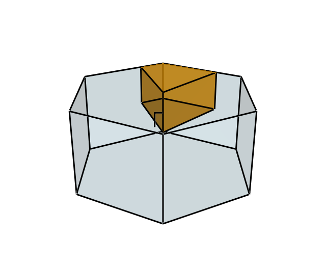
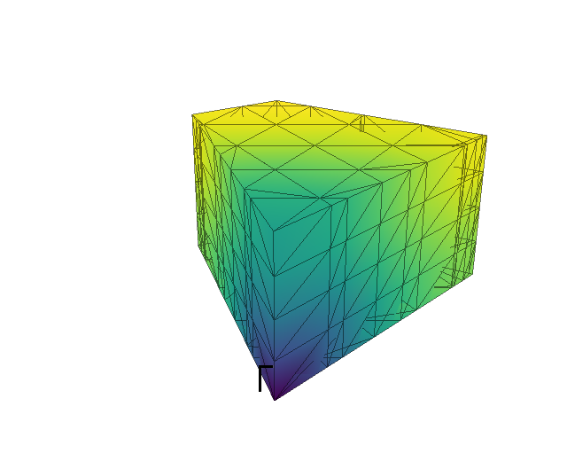
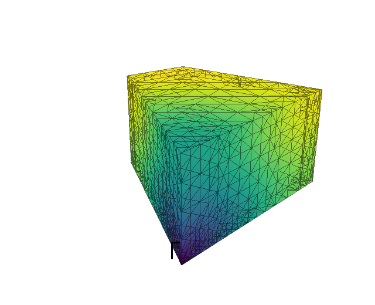

.. _tutorial_mesh:

=============================
Building and refining a mesh
=============================

In this tutorial you will build a :py:class:`~brille._brille.BZMeshQdd` for a
hexagonal crystal, fill it with a model dispersion, measure how well it
interpolates the model, and then refine it where it interpolates badly.
Along the way you will draw the Brillouin zone and the mesh with
`VisPy <https://vispy.org>`_.

The code is one script, :download:`tutorial_03.py`, which the tests run.
To run it yourself you need :py:mod:`brille`, NumPy and, for the figures,
VisPy with one of its backends (for example ``pip install vispy pyqt6``).
``python tutorial_03.py`` opens each figure in a window.

The lattice and its zones
-------------------------

Start with a hexagonal lattice, with point symmetry :math:`6/m` (Hall symbol
``-P 6``), and find its Brillouin zone:

.. literalinclude:: tutorial_03.py
  :start-after: # [lattice]
  :end-before: # [/lattice]

.. code-block:: text

  first zone volume      6.3650 Å⁻³
  irreducible volume     0.5304 Å⁻³

The first Brillouin zone is the hexagonal prism below. Its twelve symmetry
operations (six rotations, each with and without inversion) map the orange
irreducible zone onto the whole prism, so the irreducible zone is one twelfth
of it. A grid only needs to cover the irreducible zone: brille uses the
symmetry to interpolate anywhere else.

  The first Brillouin zone (blue) and the irreducible zone (orange).

A model to interpolate
----------------------

In practice the values on the grid come from an expensive calculation, such as
phonon frequencies from a force-constant model. Here a simple function stands
in: an acoustic-like branch that rises linearly from zero at the zone centre Γ.
It is built from the symmetry-equivalents of the shortest direct-lattice
vectors, so it has the lattice's periodicity and symmetry, as a real
dispersion does.

.. literalinclude:: tutorial_03.py
  :start-after: # [model]
  :end-before: # [/model]

The grids store, at each vertex, *values* (scalars such as energies) and
*vectors* (such as eigenvectors). This model has no vectors, but the grid still
expects them, so ``grid_data`` gives one zero per point:

.. literalinclude:: tutorial_03.py
  :start-after: # [data]
  :end-before: # [/data]

Build and fill the mesh
-----------------------

:py:class:`~brille._brille.BZMeshQdd` holds real (``d`` for ``double``) values
and vectors; use ``BZMeshQdc`` for complex vectors, such as phonon
eigenvectors. ``max_size`` is the largest tetrahedron volume, in Å⁻³. The mesh
is a grid of the reciprocal lattice, divided finely enough that its tetrahedra
are no bigger than that, and clipped exactly to the irreducible zone.

.. literalinclude:: tutorial_03.py
  :start-after: # [build]
  :end-before: # [/build]

.. code-block:: text

  initial mesh           197 vertices, 620 tetrahedra

The vertices are available in reciprocal lattice units as ``mesh.rlu`` and in
Å⁻¹ as ``mesh.invA``; ``mesh.tetrahedra`` lists each tetrahedron's four vertex
indices. Evaluate the model at ``mesh.rlu`` and pass the results to
:py:meth:`~brille._brille.BZMeshQdc.fill`, in the same order.

The figure below shows the mesh's surface, coloured by energy, from dark at Γ to
yellow at the zone boundary.

  The initial mesh: 197 vertices.

How good is the interpolation?
------------------------------

To judge the mesh, compare what it interpolates with the model itself. Two
measures are useful: the error at the centre of each tetrahedron, which says
where the mesh is too coarse, and the root-mean-square error at random points,
which says how good it is overall.

.. literalinclude:: tutorial_03.py
  :start-after: # [errors]
  :end-before: # [/errors]

.. code-block:: text

  largest centre error   0.965 meV
  rms error              0.2307 meV

:py:meth:`~brille._brille.BZMeshQdc.ir_interpolate_at` accepts points anywhere
in reciprocal space; it moves each into the irreducible zone, interpolates
there, and (for vectors) rotates the result back.

Refine where needed
-------------------

The errors are largest near Γ, where the energy has a sharp cone that linear
interpolation cannot follow. Refining the whole mesh would waste points where
it is already good. Instead, mark the tetrahedra whose centre error is above a
tolerance and refine only those:

.. literalinclude:: tutorial_03.py
  :start-after: # [refine]
  :end-before: # [/refine]

Each step has three parts:

#. :py:meth:`~brille._brille.BZMeshQdc.refinement_points` returns the vertices a
   refinement would add, without changing the mesh.
#. Evaluate the model at those points.
#. :py:meth:`~brille._brille.BZMeshQdc.refine` adds the vertices with the
   model's values. Existing vertices keep their indices and their data.

To keep the mesh conforming, refinement may also split neighbouring tetrahedra
that were not marked. It also splits equivalent edges on the zone boundary
together, so that the mesh keeps matching itself across equivalent zone faces.

The cone at Γ never becomes linear, however small the tetrahedra are, so
without a limit this loop would continue until it ran out of memory. The
``resolution`` argument stops it. No edge is split below
``resolution / points_per_resolution`` (here 0.05 Å⁻¹ / 2), so there is no
detail finer than an instrument could resolve.

.. code-block:: text

  step 0:   527 tetrahedra marked,   295 vertices added
  step 1:  1180 tetrahedra marked,   890 vertices added
  step 2:  1797 tetrahedra marked,  1020 vertices added
  step 3:  1463 tetrahedra marked,   874 vertices added
  step 4:   639 tetrahedra marked,   410 vertices added
  step 5:   284 tetrahedra marked,    91 vertices added
  step 6:   197 tetrahedra marked,    12 vertices added
  step 7:   194 tetrahedra marked,     3 vertices added
  refined mesh           3792 vertices, 18042 tetrahedra
  largest centre error   0.135 meV
  rms error              0.0238 meV

The last steps still mark tetrahedra but add almost nothing: those tetrahedra
touch Γ and are already at the resolution limit.

  The refined mesh: 3,792 vertices, concentrated around Γ.

Compare with uniform refinement
-------------------------------

Passing ``None`` (the default) as ``where`` refines every tetrahedron. Refining
the initial mesh uniformly until it has at least as many vertices gives a worse
result:

.. literalinclude:: tutorial_03.py
  :start-after: # [uniform]
  :end-before: # [/uniform]

.. code-block:: text

  uniformly refined      6032 vertices, rms error 0.0316 meV

Refining only where the model needs it gives a smaller error with about 60% of
the vertices. Every vertex means one more evaluation of the model, so fewer
vertices means less time filling the mesh.

Save and reload
---------------

A mesh, its data and its refinement history can be saved to an HDF5 file.
A reloaded mesh can be refined further:

.. literalinclude:: tutorial_03.py
  :start-after: # [save]
  :end-before: # [/save]

.. code-block:: text

  reloaded               3792 vertices, refinable: True

Drawing with VisPy
------------------

The figures come from these helpers. ``zone_visuals`` uses
:py:mod:`brille.vis` to turn a zone polyhedron into VisPy visuals, and
``surface_visuals`` draws the triangles on the mesh's boundary, which are the
faces that belong to only one tetrahedron.

.. literalinclude:: tutorial_03.py
  :start-after: # [draw]
  :end-before: # [/draw]

Each figure is then one call to ``show``. For example, the refined mesh:

.. literalinclude:: tutorial_03.py
  :start-after: # [figure-refined]
  :end-before: # [/figure-refined]
  :dedent: 4

``python tutorial_03.py --save DIRECTORY`` writes the figures as PNG files
instead of showing them. On a machine without a display, add
``--backend egl`` to draw them with EGL, which needs an OpenGL driver such as
Mesa (on Debian or Ubuntu: ``apt install libegl1 libgl1-mesa-dri``).

Next steps
----------

- :ref:`howto_trellis_to_mesh` compares :py:class:`~brille._brille.BZMeshQdc`
  with :py:class:`~brille._brille.BZTrellisQdc`, and shows how to switch.
- :py:class:`~brille._brille.BZMeshQdc` documents every method of the mesh.
